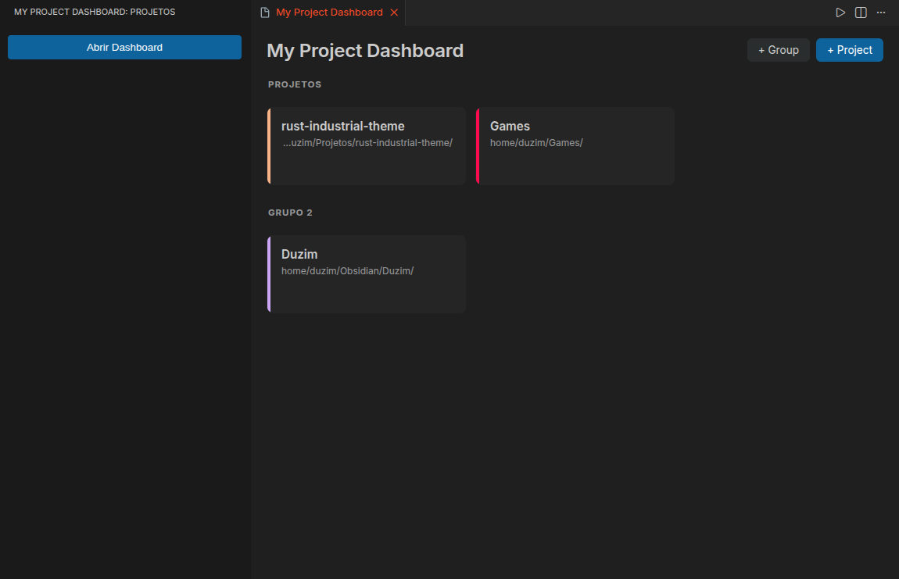
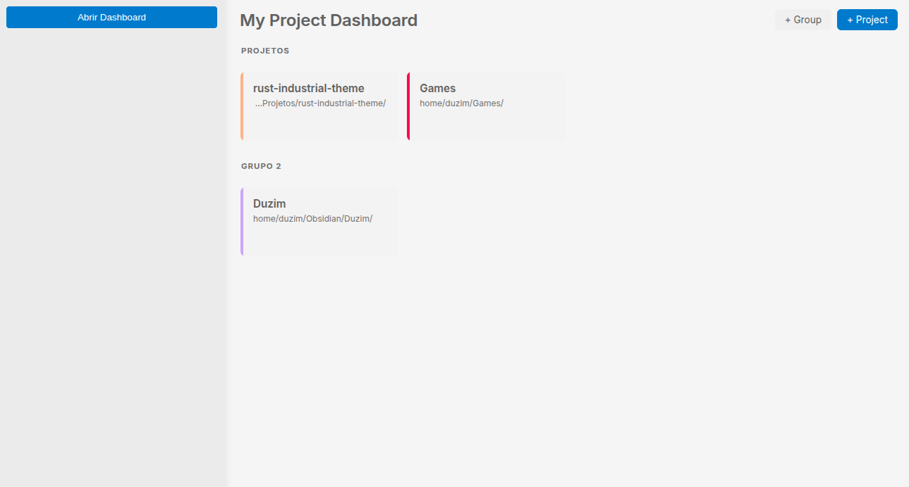

# Project Board

> **Language / Idioma:** [English](#english) · [Português](#português)

A visual dashboard to organize, group, and quickly open your projects in VS Code — like a home page for your repositories.

| Dark | Light |
|---|---|
|  |  | 

<!--
  ⚠️ ANTES DE PUBLICAR, substitua:
  - SEU-PUBLISHER  → o id do seu publisher no Marketplace
  - SEU-USUARIO    → seu usuário do GitHub
  - images/...     → coloque seus screenshots/GIF na pasta images/ do repositório
  Caminhos de imagem precisam ser RELATIVOS ao repositório (o Marketplace
  resolve a partir do seu repo), ou use URLs absolutas (https://...).
-->

---

## English

### Features

- 📋 **Visual dashboard** of all your projects, opened right in the editor.
- 🗂️ **Groups** — organize projects by category (Work, Personal, Studies…).
- 🎨 **Custom colors** — pick from a palette or type your own hex/rgb.
- 🖼️ **Background image / color** per project card.
- ⚡ **One-click open** — open any project in a new window.
- 🧭 **Activity bar icon** — a launcher in the sidebar opens the dashboard.
- ✏️ **Full management** — add, edit, and remove projects and groups.
- 💾 **Persistent** — your projects are remembered across sessions.

### Getting started

1. Click the **Project Board** icon in the activity bar (left vertical strip).
2. Click **Open Dashboard**.
3. Use **+ Group** to create a group, then **+ Project** to add a folder.
4. Click a card to open that project.

### Usage

| Action | How |
|---|---|
| Open the dashboard | Activity bar icon → *Open Dashboard*, or run **Open Project Dashboard** from the Command Palette (`Ctrl+Shift+P`) |
| Add a project | **+ Project** → choose a folder → name it → pick a group |
| Add a group | **+ Group** → type a name |
| Edit a project's color | **Color** button on the card |
| Edit a project's name/path | **Edit** button on the card |
| Remove a project | **Delete** button on the card |
| Rename a group | **Rename** button on the group header |
| Delete a group | **Delete** on the group header (empty groups only) |
| Open a project | Click the card |

### Requirements

- VS Code `^1.124.0` or newer.

### Release notes

See the [Changelog](CHANGELOG.md).

### License

[MIT](LICENSE)

---

## Português

Um painel visual para organizar, agrupar e abrir rapidamente seus projetos no VS Code — como uma página inicial dos seus repositórios.

### Recursos

- 📋 **Painel visual** com todos os seus projetos, aberto na área do editor.
- 🗂️ **Grupos** — organize por categoria (Trabalho, Pessoal, Estudos…).
- 🎨 **Cores personalizadas** — escolha de uma paleta ou digite seu hex/rgb.
- 🖼️ **Imagem ou cor de fundo** por card de projeto.
- ⚡ **Abrir com um clique** — abra qualquer projeto em uma nova janela.
- 🧭 **Ícone na barra de atividades** — um lançador na lateral abre o painel.
- ✏️ **Gerenciamento completo** — adicione, edite e remova projetos e grupos.
- 💾 **Persistente** — seus projetos são lembrados entre sessões.

### Primeiros passos

1. Clique no ícone **My Project Dashboard** na barra de atividades (faixa vertical à esquerda).
2. Clique em **Abrir Dashboard**.
3. Use **+ Grupo** para criar um grupo e **+ Projeto** para adicionar uma pasta.
4. Clique em um card para abrir o projeto.

### Como usar

| Ação | Como |
|---|---|
| Abrir o painel | Ícone na barra de atividades → *Abrir Dashboard*, ou rode **Open Project Dashboard** na paleta de comandos (`Ctrl+Shift+P`) |
| Adicionar projeto | **+ Projeto** → escolha a pasta → nomeie → escolha o grupo |
| Adicionar grupo | **+ Grupo** → digite um nome |
| Editar a cor de um projeto | Botão **Cor** no card |
| Editar nome/caminho | Botão **Editar** no card |
| Remover um projeto | Botão **Excluir** no card |
| Renomear um grupo | Botão **Renomear** no cabeçalho do grupo |
| Excluir um grupo | **Excluir** no cabeçalho do grupo (apenas grupos vazios) |
| Abrir um projeto | Clique no card |

### Requisitos

- VS Code `^1.124.0` ou mais recente.

### Notas de versão

Veja o [Changelog](CHANGELOG.md).

### Licença

[MIT](LICENSE)